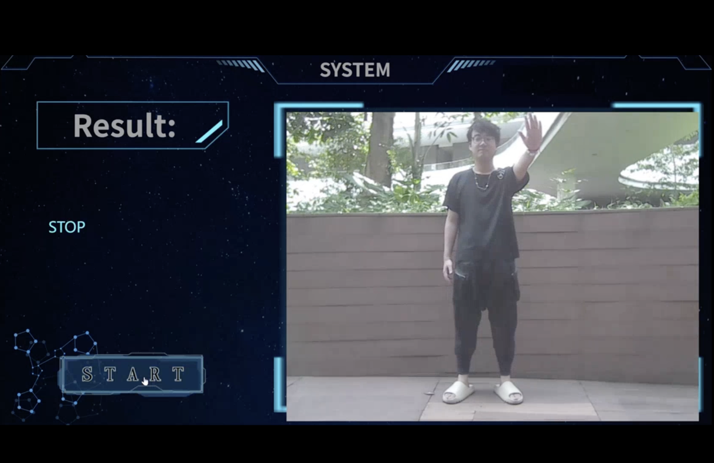

# Traffic Gesture Recognition Model for Autonomous Driving

## Introduction
The Traffic Gesture Recognition Model for Autonomous Driving is designed to enable autonomous vehicles to interpret and react to traffic police gestures in real-time, enhancing safety and efficiency in complex traffic scenarios where conventional signaling is inadequate. This system integrates advanced computer vision and deep learning techniques, such as MediaPipe and RNNs with LSTM cells, to process live camera feeds and accurately identify nuanced gestures, offering a vital interpretative tool for autonomous driving systems amidst the variable and unpredictable conditions of urban traffic.

<div style="display: flex; justify-content: space-between;">
  
  
</div>

## Features

- **Hybrid MediaPipe-LSTM Architecture**: Merges MediaPipe's keypoint detection with LSTM's sequential data processing for accurate, real-time gesture recognition.

- **Data Preprocessing and Augmentation**: Utilizes custom classes for image processing, keypoint extraction, and noise addition to enhance model robustness against real-world variances.

- **Smart Data Handling**: Leverages a tailored `SkeletonDataset` class for efficient data loading and preprocessing, ensuring smooth training and testing cycles.

- **Attention-Enhanced LSTM**: Incorporates an attention mechanism for nuanced gesture understanding, with a network design that balances depth and complexity to prevent overfitting.

- **Streamlined Training Workflow**: Features a `RNNTrainer` class for systematic model training and evaluation, with metrics visualization for ongoing performance assessment.

- **Performance-Optimized Model**: Automatically preserves the best-performing model weights, facilitating reliable deployment and consistent gesture recognition.


## System Requirements

To run the Traffic Gesture Recognition Model, your system needs to meet the following requirements:

### Software
- Python 3.6 or later
- OpenCV (cv2) - for image processing
- MediaPipe - for pose estimation and keypoint detection
- PyTorch - for machine learning model construction and evaluation
- NumPy - for numerical computing
- SciPy - for scientific and technical computing
- Pandas - for data manipulation and analysis
- Matplotlib - for creating static, interactive, and animated visualizations in Python
- Seaborn - for statistical data visualization
- scikit-learn - for machine learning and statistical modeling including classification, regression, clustering, and dimensionality reduction
- HTML - for creating and structuring web page content
- CSS - for styling and laying out web pages, including the design of colors, fonts, and spacing
- JavaScript - for creating dynamic and interactive content on web pages, such as games, responding to user actions, and updating content without reloading the page
- Flask - for building web applications quickly and with minimal setup
- CORS - for scripts running on a browser client to interact with resources from a different origin
- deque - for efficient insertion and deletion of elements from both ends.

### Hardware
- CPU: x86-64 architecture with SSE2 instruction set support
- GPU: (Optional) CUDA-capable GPU for PyTorch acceleration

### Operating System
- Compatible with Windows, macOS, or Linux operating systems that can run the software requirements mentioned above.

It is also recommended to use a virtual environment for Python to manage dependencies more effectively.

### Installation of Dependencies
To install the required libraries, use the following command:
    ```bash 
    pip install numpy opencv-python mediapipe torch pandas matplotlib seaborn scikit-learn

## Usage
### Model Training
#### 1. File Structure

- final_deployment: File contain the front-end and back-end, used for systems running gesture recognition
- gesture_data: Dataset folder (need to download the zip file from https://drive.google.com/file/d/1GT4MzNxlqzLOnVRO4zmD94H1fU79_XdI/view?usp=sharing)
  - **After download the zip file, decompress the zip file, and make sure the folder is in the same path as all the other codes!**
  
  <p style="text-align: center;">
  
</p>

- image_skeleton_data: Folder containing - image frames and skeleton data in .pkl format
- rnn_model: Folder for storing trained model parameters and evaluation visualizations
- data_augmentation.py: Data augmentation script
- get_skeleton.py: Script to get the skeleton from images
- Model_train.py: Main model training script
- RNN_data.py: RNN data processing script
- RNN_model.py: RNN model architecture script
- train_test_function.py: Functions for training and testing the model

#### 2. Initial Setup

Make sure you have all the necessary dependencies installed. If not, refer to the system requirements section.

#### 3. Parameters tuning and model training
- At the beginning of `Model_train.py` , there are model parameters that can be adjusted, including the number of RNN layers, hidden nodes, epochs, learning rate, and the number of heads for the Multi-head Attention Mechanism (num_heads).
- Use `Model_train.py` as the main file for running the model training process.

### Front-end and Back-end
#### 1. File Structure(File name called `final_deployment`)

- pycache: Python's byte-compiled cache folder
- front.css: CSS file defining appearance and styling
- front.html: HTML file defining the structure and content of the web page
- music.wav: Countdown sound
- python.py: Backend logic or server-side Python script for Medipape skeleton recognition and model prediction
- rnn_epoch73_loss0.19.pth: Saved model weights of a trained RNN
- RNN_model.py: Script defining the RNN model architecture
- script.js: JavaScript file for frontend interactivity

#### 2. Initial Setup

Make sure you have all the necessary dependencies installed. If not, refer to the system requirements section.

#### 3. Launching the Back-end

- Open a terminal or command prompt in the directory containing the frontend files.
- Run the `python.py` script to start the server:
  ```bash
  python python.py

#### 4. Launching the Front-end
- Open the `front.html` file using your preferred web browser.
- Agree to the page in the browser to call the camera permission.

#### 5. Making gesture predictions
- Click the "START" button.
<p style="text-align: center;">
  
</p>

- Wait 3 seconds for preparation.
<p style="text-align: center;">
  
</p>

- Show gestures.
<p style="text-align: center;">
  
</p>

- View the results displayed on the page.
- Repeat if you want to try again.


#### 7. Shutdown
- Close page.
- To stop the server, go back to the terminal or command prompt and press `Ctrl + C`.

##### Notes
- If any error occurs, ensure all dependencies are correctly installed.
- If you make changes to `front.css`, `script.js`, or `front.html`, you might need to restart the server for changes to take effect.
- Ensure the RNN model (`rnn_epoch73_loss0.19.pth`) is in the correct directory path as specified in the `python.py` script.

## Model Performance and Evaluation
- Performance of RNN model with LSTM and 8 head Attention Mechanism has reach the result of **lowest 0.06 loss** and **highest 96.7% accuracy**, **average accuracy is about 80%**.
<p style="text-align: center;">
  
</p>

- To evaluate the model's accuracy for various gesture categories, we employ the classification_report function from sklearn.metrics. This function computes key classification metrics such as precision, recall, and f1-score by comparing the true outputs (final_testout) to the model's predictions (final_predout). These metrics are then visualized using a heatmap generated with the matplotlib and seaborn libraries.
<p style="text-align: center;">
  
</p>

